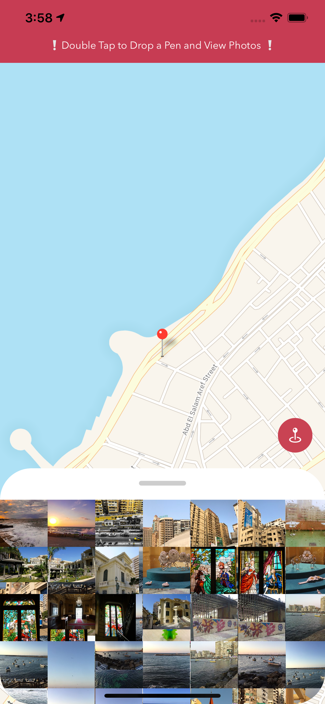
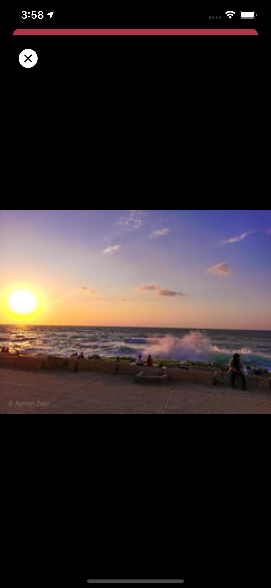

SEAR-MAP App
---

simple Ios app that uses MKMapView and CocoaPods to create MVC Ios app

we use _Alamofire_ to make REST calls and use _Alamofire Image_ to load images


### Installation 

- clone the repo & cd into the repo directory

- install dependencies
```
$ pod install
```


### Screenshots





